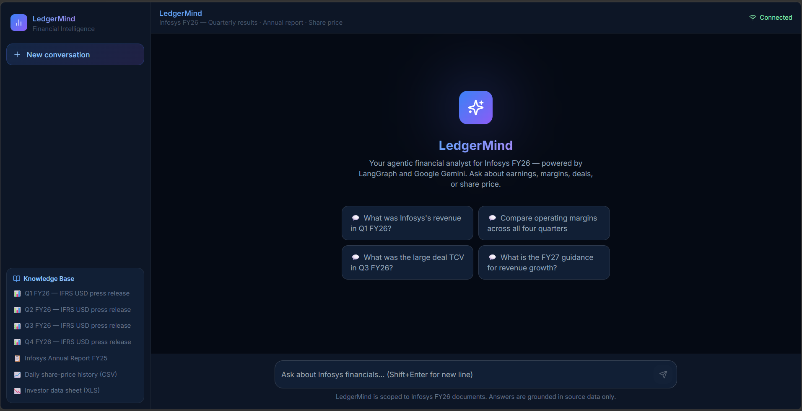
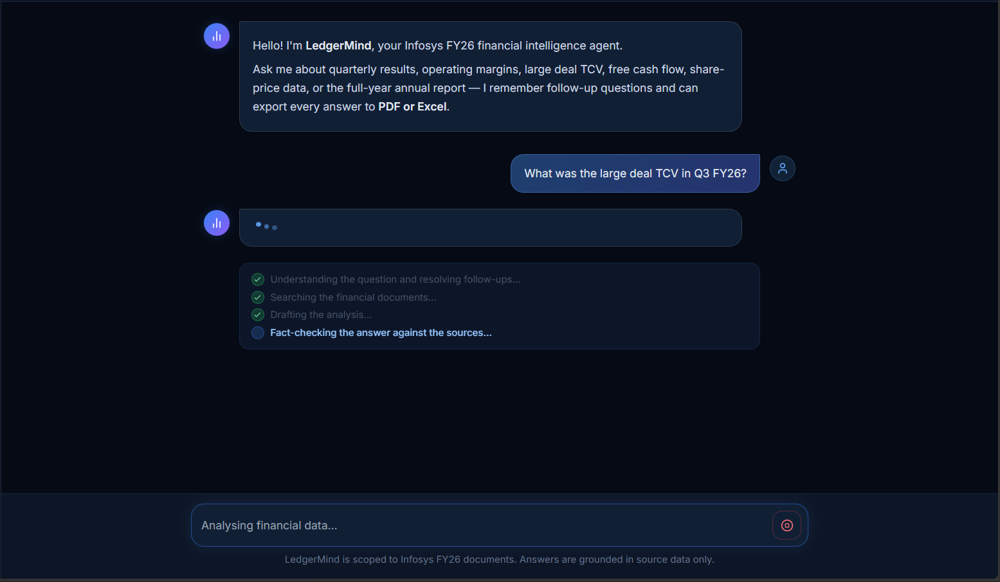

# LedgerMind - Infosys FY26 Financial Analyst Agent

An enterprise-grade agentic RAG chatbot that answers questions about Infosys FY26 financial documents. It combines semantic vector search, a live Pandas REPL, a Drafter→Critic self-correction loop, multi-turn memory, and downloadable PDF/Excel reports — all orchestrated by a LangGraph directed acyclic graph.





---

## Table of contents

1. [Architecture overview](#architecture-overview)
2. [Full tech stack](#full-tech-stack)
3. [Project structure](#project-structure)
4. [Setup](#setup)
5. [Running the application](#running-the-application)
6. [Data sources](#data-sources)
7. [How a query flows through the system](#how-a-query-flows-through-the-system)
8. [Evaluation framework](#evaluation-framework)
9. [Sprint history](#sprint-history)

---

## Architecture overview

```
┌─────────────────────────────────────────────────────────────────────────┐
│                         FRONTEND                                        │
│  Next.js 14 chatbot (port 3000)   │   Streamlit UI (port 8501)          │
│  React + Tailwind + TypeScript    │   Python + Streamlit                │
└────────────────────┬──────────────┴────────────────────┬────────────────┘
                     │  POST /chat/stream (NDJSON)       │  POST /chat/stream
                     ▼                                   ▼
┌─────────────────────────────────────────────────────────────────────────┐
│                       FastAPI Backend  (port 8000)                      │
│   /chat  /chat/stream  /history/{id}  /download/{file}  /health         │
│   CORS open · NDJSON streaming · SqliteSaver multi-turn memory          │
└────────────────────────────────┬────────────────────────────────────────┘
                                 │
                    ┌────────────▼────────────┐
                    │   LangGraph Agent DAG   │
                    │                         │
                    │  query_planner          │  ← classifies intent,
                    │       │                 │    resolves follow-ups
                    │  ┌────┴──────────┐      │
                    │  │               │      │
                    │ retrieval   quantitative│  ← Track A: ChromaDB BGE
                    │  │               │      │    Track B: Pandas REPL
                    │  └────┬──────────┘      │
                    │       │                 │
                    │    drafter              │  ← Gemini drafts answer
                    │       │                 │
                    │    critic ──(errors)──► drafter  (max 2 passes)
                    │       │                 │
                    │    format               │  ← decides PDF or Excel
                    └────────────────────────┘
                         │              │
              ┌──────────┘              └──────────┐
              ▼                                    ▼
  ┌───────────────────┐              ┌─────────────────────┐
  │   ChromaDB        │              │   Pandas DataFrames │
  │   data/chroma_db/ │              │   500209.csv        │
  │   BGE-large embed │              │   500209.xls        │
  │   BGE-reranker    │              └─────────────────────┘
  └───────────────────┘
```

---

## Full tech stack

### Backend

| Component | Technology | Notes |
|---|---|---|
| Agent orchestration | LangGraph 1.2+ | Stateful DAG with conditional routing |
| LLM | Google Gemini `gemini-3.1-flash-lite` | Temperature 0, via `langchain-google-genai` |
| Embeddings | `BAAI/bge-large-en-v1.5` (local) | 1024-dim, SentenceTransformers |
| Reranking | `BAAI/bge-reranker-base` (local) | Cross-encoder, top-20 → top-5 |
| Vector store | ChromaDB (persistent) | SQLite-backed, `langchain-chroma` |
| PDF parsing | LlamaParse (LlamaCloud API) | Best-in-class table extraction |
| Quantitative | LangChain Pandas REPL | Executes Python against pre-loaded DataFrames |
| Multi-turn memory | LangGraph SqliteSaver | Persisted to `data/agent_memory.sqlite` |
| API framework | FastAPI + uvicorn | NDJSON streaming, CORS |
| PDF export | fpdf2 + DejaVu fonts | Unicode-safe financial report generation |
| Excel export | openpyxl + pandas | Multi-sheet workbook support |

### Frontend (Next.js)

| Component | Technology |
|---|---|
| Framework | Next.js 14 (App Router) |
| Language | TypeScript 5 |
| Styling | Tailwind CSS 3 + `@tailwindcss/typography` |
| Markdown | `react-markdown` + `remark-gfm` |
| Icons | `lucide-react` |
| Session IDs | `uuid` v11 |

### Evaluation

| Component | Technology |
|---|---|
| Judge LLM | Groq `llama-3.3-70b-versatile` (free tier) |
| Metrics | MRR, Source Hit Rate, Pass Rate (custom Python) |

---

## Project structure

```
financial-analyst-agent/
│
├── README.md                    ← You are here
├── REFLECTION.md                ← Design decisions and honest critique
├── SAMPLE_CONVERSATIONS.md      ← 6 annotated sample conversations
├── pyproject.toml               ← Python dependencies (managed by uv)
├── .env                         ← API keys (NOT committed)
│
├── backend/                     ← All server-side Python
│   ├── agents/                  ← LangGraph DAG (graph.py, nodes.py, state.py, prompts.py)
│   │   └── tools/               ← vector_tool.py (ChromaDB) · pandas_tool.py (REPL)
│   ├── api/                     ← FastAPI app, endpoints, schemas
│   ├── core/                    ← Pydantic Settings (config.py)
│   ├── database/                ← ChromaDB client and retriever
│   ├── ingestion/               ← PDF → Markdown → chunks → ChromaDB pipeline
│   └── utils/                   ← PDF generator · Excel generator · DejaVu fonts
│
├── frontend/
│   ├── app.py                   ← Streamlit UI (Sprint 4)
│   ├── components/              ← Streamlit components
│   └── web/                     ← Next.js 14 chatbot (Sprint 6)
│       └── src/
│           ├── app/             ← Next.js App Router: layout, page, globals.css
│           ├── components/      ← ChatInterface, ChatMessage, ProgressIndicator, Sidebar
│           ├── lib/             ← api.ts (streaming), sessions.ts (localStorage)
│           └── types/           ← TypeScript interfaces
│
├── data/
│   ├── raw/                     ← Source PDFs, CSV, XLS (place here before ingestion)
│   ├── processed/               ← LlamaParse Markdown cache (auto-generated)
│   ├── chroma_db/               ← Vector store (auto-generated)
│   ├── exports/                 ← Generated PDF/Excel reports (auto-generated)
│   └── agent_memory.sqlite      ← LangGraph conversation checkpoints
│
├── scripts/
│   ├── run_server.sh            ← Start FastAPI backend
│   ├── run_ui.sh                ← Start Streamlit UI
│   └── test_agent.py            ← CLI smoke test
│
└── tests/
    └── evaluation/
        ├── golden_dataset.json  ← 20 ground-truth Q&A pairs
        ├── evaluator.py         ← GroqEvaluator (LLM-as-judge)
        ├── metrics.py           ← MRR, hit rate, pass rate computation
        ├── run_eval.py          ← End-to-end evaluation runner
        └── results/             ← Timestamped evaluation output JSON
```

---

## Setup

### Prerequisites

- Python 3.11+
- [uv](https://docs.astral.sh/uv/) package manager (`pip install uv`)
- Node.js 18+ (for the Next.js UI)
- Windows users: enable Long Paths (`HKLM\SYSTEM\CurrentControlSet\Control\FileSystem\LongPathsEnabled = 1`)

### 1. Clone and install Python dependencies

```bash
git clone https://github.com/TejShah11/Financial_Analyst.git
cd Financial_Analyst/financial-analyst-agent
uv sync
```

### 2. Create `.env`

```bash
# financial-analyst-agent/.env
GEMINI_API_KEY=your_google_gemini_api_key
LLAMA_CLOUD_API_KEY=your_llamacloud_api_key
GROQ_API_KEY=your_groq_api_key        # only needed for evaluation
```

Get keys from:
- Gemini: [https://aistudio.google.com/app/apikey](https://aistudio.google.com/app/apikey)
- LlamaCloud: [https://cloud.llamaindex.ai](https://cloud.llamaindex.ai)
- Groq: [https://console.groq.com](https://console.groq.com)

### 3. Place source documents in `data/raw/`

```
data/raw/
├── ifrs-usd-press-release_q1.pdf
├── ifrs-usd-press-release_q2.pdf
├── ifrs-usd-press-release_q3.pdf
├── ifrs-usd-press-release_q4.pdf
├── infosys-ar-25.pdf
├── 500209.csv
└── 500209.xls
```

### 4. Run the ingestion pipeline

```bash
uv run python -m backend.ingestion.pipeline
```

This takes 5–15 minutes on first run (LlamaParse processes each PDF). Subsequent runs are instant (cached Markdown).

### 5. Install Next.js dependencies

```bash
cd frontend/web
npm install
cd ../..
```

---

## Running the application

### Start the backend (required for all UIs)

```bash
# Terminal 1 — from financial-analyst-agent/
uv run uvicorn backend.api.main:app --reload --port 8000
```

Verify: `curl http://localhost:8000/health` → `{"status": "healthy"}`

### Option A — Next.js UI (recommended)

```bash
# Terminal 2
cd frontend/web
npm run dev
```

Open `http://localhost:3000`

### Option B — Streamlit UI

```bash
# Terminal 2 — from financial-analyst-agent/
uv run streamlit run frontend/app.py
```

Open `http://localhost:8501`

---

## Data sources

| File | Content | Used by |
|---|---|---|
| `ifrs-usd-press-release_q{1-4}.pdf` | Infosys quarterly IFRS USD earnings press releases FY26 | ChromaDB vector search |
| `infosys-ar-25.pdf` | Infosys Integrated Annual Report FY25 (full year) | ChromaDB vector search |
| `500209.csv` | BSE daily OHLCV stock price history for Infosys | Pandas REPL (quantitative) |
| `500209.xls` | 8-sheet investor data workbook (quarterly financials, ratios) | Pandas REPL (quantitative) |

---

## How a query flows through the system

**Example:** *"What was the large deal TCV in Q2 FY26 and how did it compare to Q1?"*

```
1. POST /chat/stream  {query: "...", session_id: "abc"}
        │
2. query_planner
   • Classifies intent → "narrative"
   • Resolves query (no pronouns to resolve this time)
   • resolved_query → "Large deal TCV in Q2 FY26 vs Q1 FY26"
        │
3. retrieval
   • BGE-large embeds the resolved query
   • ChromaDB ANN search: top-20 chunks filtered to q1+q2 quarters
   • BGE-reranker re-scores: top-5 chunks returned
   • context = excerpt from Q2 press release + Q1 press release
   • sources = ["ifrs-usd-press-release_q2.pdf", "ifrs-usd-press-release_q1.pdf"]
        │
4. drafter
   • Gemini receives: system prompt + context + resolved_query
   • Produces Markdown answer with dollar figures, percentages, net-new breakdown
        │
5. critic
   • Checks draft against context
   • Verifies Q2 TCV = $3.1B and Q1 TCV = $3.8B are present and correct
   • No errors → verified = true
        │
6. format
   • Classifies as "pdf" (narrative text answer)
   • output_format = "pdf"
        │
7. _generate_artifact()
   • fpdf2 renders the Markdown answer to report_a1b2c3d4.pdf
   • file_url = "/download/report_a1b2c3d4.pdf"
        │
8. StreamingResponse emits:
   {"type": "progress", "label": "Searching the financial documents..."}
   {"type": "progress", "label": "Drafting the analysis..."}
   {"type": "progress", "label": "Fact-checking the answer..."}
   {"type": "progress", "label": "Generating PDF file..."}
   {"type": "result", "answer": "...", "sources": [...], "verified": true, "file_url": "..."}
```

---

## Evaluation framework

Located in `tests/evaluation/`. Measures chatbot quality against 20 questions generated by LLM.

```bash
# Requires backend running
uv run python -m tests.evaluation.run_eval
```

**Key metrics (target):**

| Metric | Description | Target |
|---|---|---|
| MRR | Mean Reciprocal Rank of expected source | > 0.8 |
| Source Hit Rate | % questions where expected source retrieved | > 85% |
| Pass Rate | % questions with judge score ≥ 0.6 | > 80% |

See [tests/evaluation/README.md](tests/evaluation/README.md) for full details.

---

## Sprint history

| Sprint | Branch | What was built |
|---|---|---|
| 1 | `feature/sprint-1-*` | uv environment, Gemini API baseline test |
| 2 | `feature/sprint-2-*` | LlamaParse ingestion pipeline, ChromaDB with BGE embeddings |
| 3 | `feature/sprint-3-*` | LangGraph DAG (all 6 nodes), Pandas REPL quantitative track |
| 4 | `feature/sprint-4-streamlit-ui` | FastAPI backend, Streamlit UI, PDF/Excel export, SqliteSaver memory |
| 5 | `feature/sprint-5-evaluation` | Golden dataset (20 questions), Groq LLM-as-judge, MRR/pass-rate metrics |
| 6 | `feature/sprint-6-nextjs-ui` | Next.js 14 chatbot UI (current branch) |
