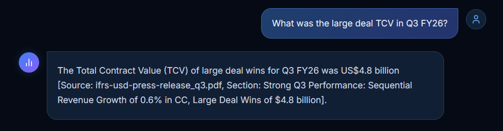
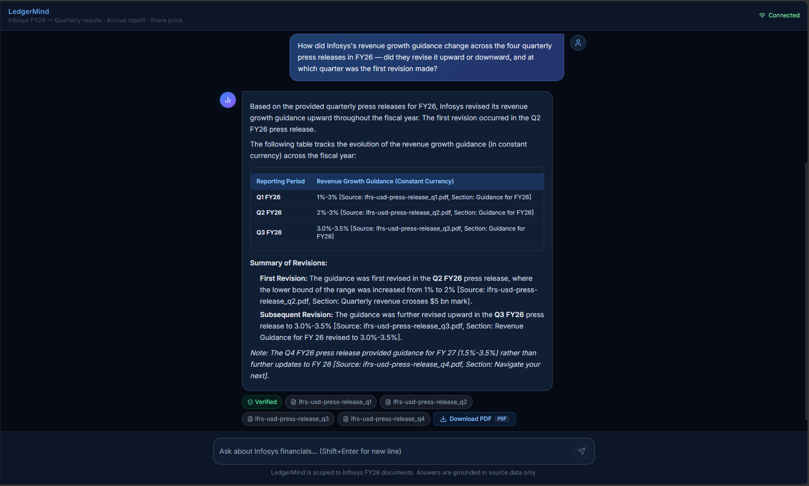
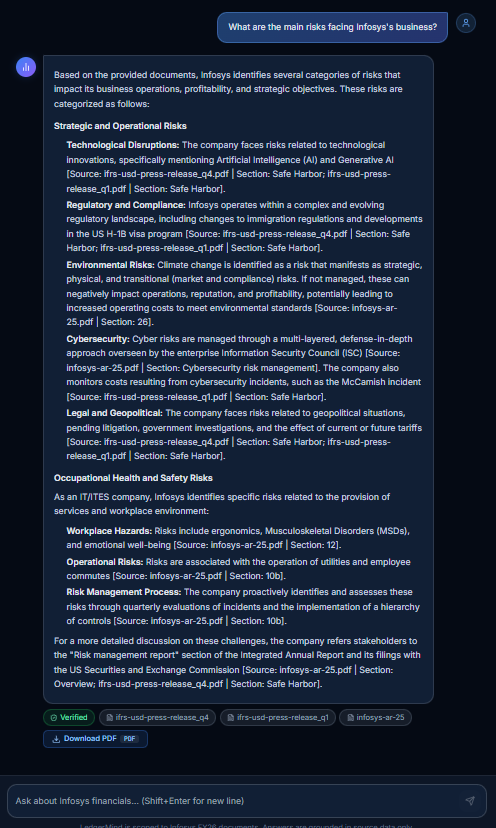
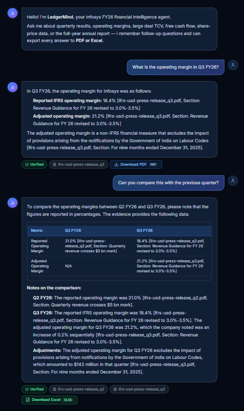
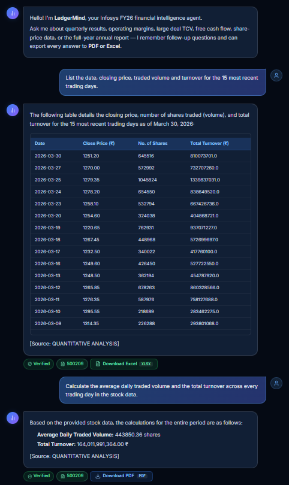
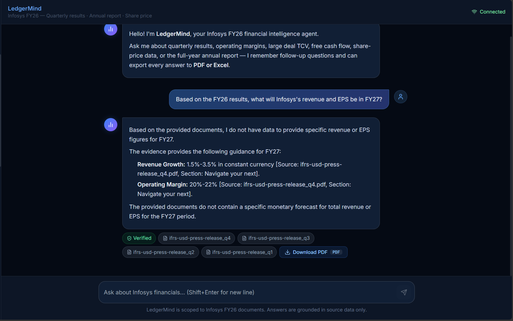

# Sample Conversations — LedgerMind

Six representative conversations demonstrating the chatbot's capabilities across different query types, routing tracks, and difficulty levels.

---

## Conversation 1

> **User:** What was the large deal TCV in Q3 FY26?

**Screenshot:**

---

## Conversation 2 

> **User:** How did Infosys's revenue growth guidance change across the four quarterly press releases in FY26 - did they revise it upward or downward, and at which quarter was the first revision made?

**Screenshot:**

---

## Conversation 3

> **User:** What are the main risks facing Infosys's business?

**Screenshot:**

---

## Conversation 4 

> **User's first prompt:** What is the operating margin in Q3 FY26?

> **User's second prompt:** Can you compare this with the previous quarter?

**Screenshot:**

---

## Conversation 5

> **User's first prompt:** List the date, closing price, traded volume and turnover for the 15 most recent trading days.

> **User's second prompt:** Calculate the average daily traded volume and the total turnover across every trading day in the stock data.

**Screenshot:**

---

## Conversation 6

> **User:** Based on the FY26 results, what will Infosys's revenue and EPS be in FY27?

**Screenshot:**

---

> **Note:** Screenshots are taken from the Next.js frontend (`frontend/web/`) running against the FastAPI backend at `http://localhost:8000`. To run: `cd frontend/web && npm run dev`.
